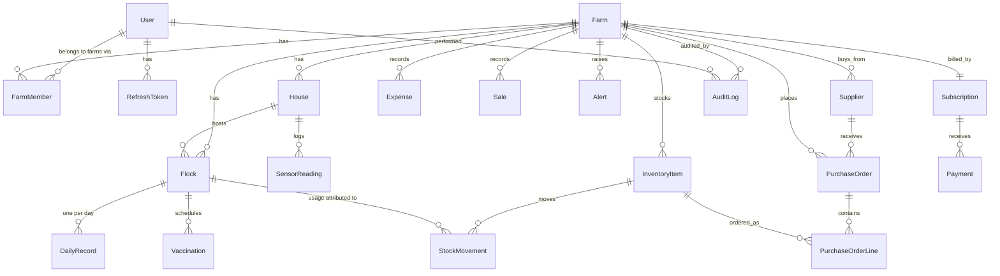

# Database Schema

Source of truth: [`apps/api/prisma/schema.prisma`](../apps/api/prisma/schema.prisma).
PostgreSQL 16; migrations via `npx prisma migrate dev|deploy`.

## Entity-relationship diagram

## Key design decisions

**Tenancy pivot — `FarmMember`.** A user holds a *different role per farm*
(`@@unique([farmId, userId])`). Every domain table hangs off `Farm`; no query
executes without a farm scope, which is what makes multi-farm switching and
row-level isolation trivial.

**`DailyRecord` is the heartbeat.** One row per flock per day
(`@@unique([flockId, date])`) — the entry form is an *upsert*, so corrections
during the day never duplicate. All KPIs (FCR, ADG, mortality, hen-day %) are
**derived at read time** by `KpiService` from this table rather than stored,
so a backdated correction automatically fixes every downstream number. The
`[flockId, date]` index keeps 100k-bird farms (≈ tens of rows/day — records are
per-flock, not per-bird) fast for years; if IoT sensor volume grows,
`SensorReading` is the only table that would move to Timescale.

**Inventory is a ledger.** `InventoryItem.quantity` is the cached balance;
`StockMovement` is the append-only truth (purchases +, usage −), with optional
`flockId` so feed/meds cost lands on the batch that consumed it — that powers
per-batch profitability (`sales − chick cost − attributed movements − allocated
expenses`).

**Billing is gateway-agnostic.** `Subscription` stores the plan + status and
whichever gateway reference is active; `Payment.externalId` is unique, making
webhook processing idempotent (a replayed Stripe/PayPal/Coinbase event upserts
into the same row).

**Money is `Decimal(12,2)`**, never float. Weights/feed are floats (measurement
data, not accounting).

**Deletes cascade inside a farm, never across.** Removing a farm removes its
children; audit logs `SetNull` so history survives user deletion (POPIA/GDPR:
delete the `User` row, keep anonymized audit trail).

## Table-by-table summary

| Table | Purpose | Notable fields |
|---|---|---|
| `User` / `RefreshToken` | Identity; rotating refresh tokens hashed at rest | `isPlatformAdmin` |
| `Farm` | Tenant root; location for Waze links | `latitude/longitude`, `currency`, `timezone` |
| `FarmMember` | Role per user per farm | `role: OWNER\|MANAGER\|WORKER\|ADMIN` |
| `House` | Physical building + environment targets | `tempMinC/tempMaxC/humidityMaxPct` drive alerts |
| `Flock` | A batch of birds in a house | `type: BROILER\|LAYER\|BREEDER`, `birdsPlaced`, `costPerChick` |
| `DailyRecord` | Daily entry (mortality, feed, water, weight, eggs) | unique `(flockId, date)` |
| `SensorReading` | Temp/humidity, manual or IoT | indexed newest-first |
| `Vaccination` | Schedule + completion | `dueDate` vs `givenAt` → VACCINATION_DUE alerts |
| `InventoryItem` | Feed/vaccine/medication/equipment/packaging | `reorderLevel` → LOW_STOCK alerts, `expiryDate` |
| `StockMovement` | Signed ledger, optional flock attribution | `type: PURCHASE\|USAGE\|ADJUSTMENT\|TRANSFER` |
| `Supplier` / `PurchaseOrder` / `PurchaseOrderLine` | Procurement; receiving a PO posts PURCHASE movements | supplier geo → Waze route |
| `Expense` / `Sale` | Finance, optionally per-flock | power revenue/cost/profit charts |
| `Alert` | Persisted alert feed (also pushed via WS) | `kind`, `severity`, `readAt` |
| `Subscription` / `Payment` | Plan + gateway refs; idempotent payment log | `Payment.externalId @unique` |
| `AuditLog` | Every mutating request | who, farm, action, entity, IP |
